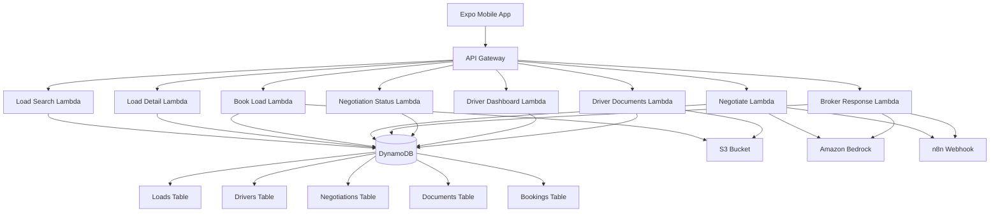

# Design Document: Backend Infrastructure Setup

## Overview

The feightly.ai backend infrastructure is a serverless architecture built on AWS services. The system uses DynamoDB for data persistence, Lambda functions for business logic, API Gateway for RESTful endpoints, S3 for document storage, and Amazon Bedrock for AI-powered negotiation email generation. The infrastructure is defined using Infrastructure as Code (IaC) with AWS CDK or SAM for consistent, repeatable deployments.

The architecture follows a microservices pattern where each Lambda function handles a specific business capability. API Gateway serves as the entry point, routing requests to appropriate Lambda functions. DynamoDB provides fast, scalable NoSQL storage with single-table design patterns where appropriate. The system integrates with external services (n8n for email automation) via webhooks.

## Architecture

### High-Level Architecture



### Data Flow Patterns

1. **Load Search Flow**: Mobile app → API Gateway → Load Search Lambda → DynamoDB Loads table → Response
2. **Booking Flow**: Mobile app → API Gateway → Book Load Lambda → DynamoDB (Loads, Bookings, Documents) + S3 → Response
3. **Negotiation Flow**: Mobile app → API Gateway → Negotiate Lambda → DynamoDB + Bedrock + n8n → Response
4. **Broker Response Flow**: n8n webhook → API Gateway → Broker Response Lambda → DynamoDB + Bedrock + n8n → Response

### Technology Stack

- **Runtime**: Node.js 18 for all Lambda functions
- **Database**: AWS DynamoDB (5 tables)
- **API**: AWS API Gateway REST API
- **Storage**: AWS S3 for documents
- **AI**: Amazon Bedrock (Claude 3 Haiku model)
- **IaC**: AWS CDK or SAM
- **Region**: us-east-1

## Components and Interfaces

### DynamoDB Tables

#### Loads Table
```typescript
interface Load {
  loadId: string;                    // Partition key
  origin: Location;
  destination: Location;
  distanceMiles: number;
  equipment: 'Dry Van' | 'Reefer' | 'Flatbed';
  weightLbs: number;
  postedRate: number;
  marketRateAvg: number;
  marketRateHigh: number;
  marketRateLow: number;
  rateTrend: 'rising' | 'falling' | 'stable';
  bookingType: 'book_now' | 'negotiable' | 'hot';
  bookNowRate?: number;
  broker: BrokerInfo;
  pickupWindow: string;
  deliveryDeadline: string;
  status: 'available' | 'booked' | 'in_negotiation';
}

interface Location {
  city: string;
  state: string;
  lat: number;
  lng: number;
  address: string;
}

interface BrokerInfo {
  name: string;
  contact: string;
  email: string;
  phone: string;
  rating: number;
  paymentTerms: string;
  onTimePayment: number;
}
```

#### Drivers Table
```typescript
interface Driver {
  driverId: string;                  // Partition key
  name: string;
  homeBase: LocationBase;
  currentLocation: LocationBase;
  equipment: string;
  preferredLanes: string[];
  avoidRegions: string[];
  minRate: number;
}

interface LocationBase {
  city: string;
  state: string;
  lat: number;
  lng: number;
}
```

#### Negotiations Table
```typescript
interface Negotiation {
  negotiationId: string;             // Partition key
  loadId: string;
  driverId: string;
  brokerEmail: string;
  driverMinRate: number;
  marketRate: number;
  postedRate: number;
  maxRounds: number;
  currentRound: number;
  strategy: 'aggressive' | 'moderate' | 'conservative';
  status: 'in_progress' | 'accepted' | 'rejected' | 'walked_away';
  offers: Offer[];
  n8nWebhookUrl: string;
}

interface Offer {
  round: number;
  amount: number;
  sender: 'driver' | 'broker';
  timestamp: string;
  emailBody: string;
}
```

#### Documents Table
```typescript
interface Document {
  docId: string;                     // Partition key
  loadId: string;
  driverId: string;
  docType: 'rate_confirmation' | 'bol' | 'pod' | 'invoice';
  s3Key: string;
  createdAt: string;
}
```

#### Bookings Table
```typescript
interface Booking {
  bookingId: string;                 // Partition key
  loadId: string;
  driverId: string;
  finalRate: number;
  status: 'confirmed' | 'in_transit' | 'delivered';
  bookedAt: string;
  rateConDocId: string;
}
```

### Lambda Functions

#### 1. Load Search Lambda
**Endpoint**: GET /loads

**Query Parameters**:
- originCity (optional)
- destCity (optional)
- equipment (optional)
- minRate (optional)
- maxDeadhead (optional)
- bookingType (optional)

**Logic**:
1. Parse and validate query parameters
2. Build DynamoDB scan/query with filter expressions
3. If maxDeadhead is provided, retrieve driver's currentLocation and calculate distance
4. Filter loads by status = "available"
5. Apply all filter criteria
6. Return filtered loads with pagination support

**Response**:
```typescript
{
  loads: Load[];
  nextToken?: string;
  hasMore: boolean;
}
```

#### 2. Load Detail Lambda
**Endpoint**: GET /loads/{loadId}

**Logic**:
1. Extract loadId from path parameters
2. Query DynamoDB Loads table by loadId
3. If not found, return 404 error
4. Return complete load details

**Response**: Load object or error

#### 3. Book Load Lambda
**Endpoint**: POST /loads/{loadId}/book

**Request Body**:
```typescript
{
  driverId: string;
}
```

**Logic**:
1. Extract loadId and driverId
2. Use DynamoDB transaction to:
   - Check load exists and status = "available"
   - Create booking record with status "confirmed"
   - Update load status to "booked"
3. Generate rate confirmation document (PDF or text)
4. Upload document to S3
5. Create document record in Documents table
6. Return booking details

**Response**:
```typescript
{
  bookingId: string;
  loadId: string;
  finalRate: number;
  rateConDocId: string;
  status: 'confirmed';
}
```

#### 4. Negotiate Lambda
**Endpoint**: POST /negotiate

**Request Body**:
```typescript
{
  loadId: string;
  driverId: string;
  strategy: 'aggressive' | 'moderate' | 'conservative';
}
```

**Logic**:
1. Retrieve load and driver information from DynamoDB
2. Generate negotiationId (UUID)
3. Create negotiation record with status "in_progress", currentRound = 1
4. Build Bedrock prompt with:
   - Load details (origin, destination, distance, equipment)
   - Market rates (avg, high, low, trend)
   - Posted rate
   - Driver's minimum rate
   - Strategy (aggressive/moderate/conservative)
5. Call Bedrock to generate first negotiation email
6. Store first offer in negotiation record
7. Send email to n8n webhook for delivery
8. Return negotiationId and initial offer

**Response**:
```typescript
{
  negotiationId: string;
  status: 'in_progress';
  initialOffer: {
    round: 1;
    amount: number;
    emailBody: string;
  };
}
```

#### 5. Broker Response Lambda
**Endpoint**: POST /negotiations/{negotiationId}/broker-response

**Request Body**:
```typescript
{
  brokerEmail: string;
  emailBody: string;
  counterOffer?: number;
}
```

**Logic**:
1. Retrieve negotiation record from DynamoDB
2. Parse broker's response to extract counter-offer amount
3. Increment currentRound
4. Add broker's offer to offers list
5. Decision logic:
   - If broker accepts driver's rate OR counter-offer >= driverMinRate:
     - Update negotiation status to "accepted"
     - Create booking via Book Load Lambda logic
     - Return success
   - Else if currentRound < maxRounds:
     - Call Bedrock to generate counter-offer email
     - Add driver's counter-offer to offers list
     - Send email to n8n webhook
     - Return in_progress status
   - Else (currentRound >= maxRounds):
     - Update negotiation status to "walked_away"
     - Return walked_away status
6. Update negotiation record in DynamoDB

**Response**:
```typescript
{
  negotiationId: string;
  status: 'in_progress' | 'accepted' | 'walked_away';
  currentRound: number;
  latestOffer?: {
    round: number;
    amount: number;
    sender: string;
  };
  bookingId?: string;  // Only if accepted
}
```

#### 6. Negotiation Status Lambda
**Endpoint**: GET /negotiations/{negotiationId}

**Logic**:
1. Extract negotiationId from path parameters
2. Query DynamoDB Negotiations table
3. Return complete negotiation record

**Response**: Negotiation object

#### 7. Driver Dashboard Lambda
**Endpoint**: GET /driver/{driverId}/dashboard

**Logic**:
1. Query Bookings table for all bookings where driverId matches
2. Filter bookings with status "delivered"
3. Calculate:
   - totalEarnings = sum of (finalRate * distanceMiles) for all delivered bookings
   - loadsCompleted = count of delivered bookings
   - avgRate = totalEarnings / total miles across all delivered bookings
4. Return dashboard metrics

**Response**:
```typescript
{
  driverId: string;
  totalEarnings: number;
  loadsCompleted: number;
  avgRate: number;
}
```

#### 8. Driver Documents Lambda
**Endpoint**: GET /driver/{driverId}/documents

**Logic**:
1. Query Documents table for all documents where driverId matches
2. For each document, generate presigned S3 URL (valid for 1 hour)
3. Return list of documents with download URLs

**Response**:
```typescript
{
  documents: Array<{
    docId: string;
    loadId: string;
    docType: string;
    createdAt: string;
    downloadUrl: string;
  }>;
}
```

### API Gateway Configuration

**Base URL**: https://api.feightly.ai (or API Gateway generated URL)

**CORS Configuration**:
- Allow-Origin: * (or specific Expo app origin)
- Allow-Methods: GET, POST, OPTIONS
- Allow-Headers: Content-Type, Authorization

**Request Validation**:
- Validate required path parameters
- Validate required request body fields
- Validate query parameter types

**Authentication**: (Future requirement - not in current scope)

### Infrastructure as Code Structure

Using AWS CDK (TypeScript):

```typescript
// lib/feightly-backend-stack.ts
export class FeightlyBackendStack extends Stack {
  constructor(scope: Construct, id: string, props?: StackProps) {
    super(scope, id, props);

    // DynamoDB Tables
    const loadsTable = new Table(this, 'LoadsTable', {
      partitionKey: { name: 'loadId', type: AttributeType.STRING },
      billingMode: BillingMode.PAY_PER_REQUEST,
    });

    const driversTable = new Table(this, 'DriversTable', {
      partitionKey: { name: 'driverId', type: AttributeType.STRING },
      billingMode: BillingMode.PAY_PER_REQUEST,
    });

    const negotiationsTable = new Table(this, 'NegotiationsTable', {
      partitionKey: { name: 'negotiationId', type: AttributeType.STRING },
      billingMode: BillingMode.PAY_PER_REQUEST,
    });

    const documentsTable = new Table(this, 'DocumentsTable', {
      partitionKey: { name: 'docId', type: AttributeType.STRING },
      billingMode: BillingMode.PAY_PER_REQUEST,
    });

    const bookingsTable = new Table(this, 'BookingsTable', {
      partitionKey: { name: 'bookingId', type: AttributeType.STRING },
      billingMode: BillingMode.PAY_PER_REQUEST,
    });

    // S3 Bucket for documents
    const documentsBucket = new Bucket(this, 'DocumentsBucket', {
      encryption: BucketEncryption.S3_MANAGED,
      blockPublicAccess: BlockPublicAccess.BLOCK_ALL,
    });

    // Lambda Functions (example for one)
    const loadSearchLambda = new NodejsFunction(this, 'LoadSearchLambda', {
      runtime: Runtime.NODEJS_18_X,
      handler: 'handler',
      entry: 'lambda/load-search.ts',
      environment: {
        LOADS_TABLE_NAME: loadsTable.tableName,
        DRIVERS_TABLE_NAME: driversTable.tableName,
      },
      timeout: Duration.seconds(30),
      memorySize: 512,
    });

    loadsTable.grantReadData(loadSearchLambda);
    driversTable.grantReadData(loadSearchLambda);

    // API Gateway
    const api = new RestApi(this, 'FeightlyApi', {
      restApiName: 'Feightly API',
      defaultCorsPreflightOptions: {
        allowOrigins: Cors.ALL_ORIGINS,
        allowMethods: Cors.ALL_METHODS,
      },
    });

    // API Resources and Methods
    const loads = api.root.addResource('loads');
    loads.addMethod('GET', new LambdaIntegration(loadSearchLambda));

    const load = loads.addResource('{loadId}');
    load.addMethod('GET', new LambdaIntegration(loadDetailLambda));

    // ... additional resources and methods
  }
}
```

## Data Models

### Validation Rules

All data models must enforce the following validation rules:

1. **Equipment Type**: Must be one of "Dry Van", "Reefer", or "Flatbed"
2. **Booking Type**: Must be one of "book_now", "negotiable", or "hot"
3. **Rate Trend**: Must be one of "rising", "falling", or "stable"
4. **Load Status**: Must be one of "available", "booked", or "in_negotiation"
5. **Negotiation Strategy**: Must be one of "aggressive", "moderate", or "conservative"
6. **Negotiation Status**: Must be one of "in_progress", "accepted", "rejected", or "walked_away"
7. **Booking Status**: Must be one of "confirmed", "in_transit", or "delivered"
8. **Document Type**: Must be one of "rate_confirmation", "bol", "pod", or "invoice"
9. **Numeric Fields**: All rates, distances, and weights must be positive numbers
10. **Email Format**: Broker email must match standard email regex pattern
11. **Timestamps**: All timestamps must be in ISO 8601 format

### DynamoDB Access Patterns

1. **Get load by ID**: Query Loads table by loadId (partition key)
2. **Search loads**: Scan Loads table with filter expressions
3. **Get driver by ID**: Query Drivers table by driverId (partition key)
4. **Get negotiation by ID**: Query Negotiations table by negotiationId (partition key)
5. **Get bookings by driver**: Scan Bookings table with filter on driverId (consider GSI for production)
6. **Get documents by driver**: Scan Documents table with filter on driverId (consider GSI for production)
7. **Update load status**: UpdateItem on Loads table
8. **Create booking**: PutItem on Bookings table
9. **Update negotiation**: UpdateItem on Negotiations table

### Concurrency Handling

For the booking operation, we must handle concurrent requests to book the same load. Use DynamoDB conditional writes:

```typescript
// Conditional update to ensure load is still available
const params = {
  TableName: 'Loads',
  Key: { loadId },
  UpdateExpression: 'SET #status = :booked',
  ConditionExpression: '#status = :available',
  ExpressionAttributeNames: { '#status': 'status' },
  ExpressionAttributeValues: {
    ':available': 'available',
    ':booked': 'booked',
  },
};
```

If the condition fails, return 409 Conflict error indicating the load is no longer available.


## Correctness Properties

*A property is a characteristic or behavior that should hold true across all valid executions of a system—essentially, a formal statement about what the system should do. Properties serve as the bridge between human-readable specifications and machine-verifiable correctness guarantees.*

### Load Search and Filtering Properties

**Property 1: Query parameter filtering correctness**
*For any* set of loads in the database and any combination of valid query parameters (originCity, destCity, equipment, minRate, bookingType), the search results should contain only loads that match ALL provided filter criteria.
**Validates: Requirements 2.2, 2.3, 2.4, 2.5, 2.7**

**Property 2: Available loads only**
*For any* load search query, all returned loads should have status "available" regardless of other filter criteria.
**Validates: Requirements 2.8**

**Property 3: Distance-based filtering**
*For any* driver location and maxDeadhead parameter, all returned loads should have origin locations within maxDeadhead miles of the driver's current location.
**Validates: Requirements 2.6**

**Property 4: Load retrieval round-trip**
*For any* valid load stored in the database, retrieving it by loadId should return a load object with identical field values.
**Validates: Requirements 2.10**

### Booking Properties

**Property 5: Booking precondition enforcement**
*For any* booking attempt, the booking should succeed if and only if the load exists and has status "available".
**Validates: Requirements 3.2**

**Property 6: Booking state consistency**
*For any* successful booking operation, the system should atomically: (1) create a booking record with status "confirmed", (2) update the load status to "booked", (3) create a document record with docType "rate_confirmation", and (4) store a document in S3.
**Validates: Requirements 3.4, 3.5, 3.6, 3.7**

**Property 7: Booking response completeness**
*For any* successful booking, the response should contain bookingId, loadId, finalRate, rateConDocId, and status fields.
**Validates: Requirements 3.8**

**Property 8: Booking concurrency safety**
*For any* load, when multiple concurrent booking requests are made, at most one booking should succeed and the others should receive conflict errors.
**Validates: Requirements 3.9**

### Negotiation Properties

**Property 9: Negotiation initialization**
*For any* valid negotiation request, starting a negotiation should create a negotiation record with status "in_progress", currentRound = 1, and the first offer stored in the offers list.
**Validates: Requirements 4.3, 4.6**

**Property 10: Negotiation response structure**
*For any* negotiation start, the response should contain negotiationId, status, and initialOffer with round, amount, and emailBody fields.
**Validates: Requirements 4.7**

**Property 11: Bedrock integration for initial offer**
*For any* negotiation start, the system should call Amazon Bedrock with load details, market rates, posted rate, driver minimum rate, and strategy to generate the first email.
**Validates: Requirements 4.4**

**Property 12: Webhook notification**
*For any* negotiation email generation (initial or counter-offer), the system should send the email to the configured n8n webhook URL.
**Validates: Requirements 4.5**

**Property 13: Broker acceptance handling**
*For any* broker response where the broker accepts the driver's rate OR offers a rate >= driver's minimum rate, the negotiation status should be updated to "accepted" and a booking should be created.
**Validates: Requirements 4.11, 4.12**

**Property 14: Negotiation continuation**
*For any* broker counter-offer below the driver's minimum rate, if currentRound < maxRounds, the system should generate a counter-offer via Bedrock and continue the negotiation.
**Validates: Requirements 4.13**

**Property 15: Negotiation termination**
*For any* broker counter-offer below the driver's minimum rate, if currentRound >= maxRounds, the negotiation status should be updated to "walked_away".
**Validates: Requirements 4.14**

**Property 16: Offer history accumulation**
*For any* negotiation, each broker response and driver counter-offer should be appended to the offers list with correct round number, amount, sender, and timestamp.
**Validates: Requirements 4.15**

**Property 17: Negotiation retrieval round-trip**
*For any* negotiation record stored in the database, retrieving it by negotiationId should return the complete negotiation including all offers and current status.
**Validates: Requirements 4.17**

### Driver Dashboard Properties

**Property 18: Dashboard metrics calculation**
*For any* driver with completed bookings, the dashboard should correctly calculate: (1) totalEarnings as sum of (finalRate × distanceMiles), (2) loadsCompleted as count of delivered bookings, and (3) avgRate as totalEarnings divided by total miles.
**Validates: Requirements 5.2, 5.3, 5.4, 5.5**

### Document Management Properties

**Property 19: Driver document filtering**
*For any* driver, the documents endpoint should return only documents where driverId matches the requested driver.
**Validates: Requirements 5.7**

**Property 20: Document response structure**
*For any* document returned, it should contain docId, docType, loadId, createdAt, and a valid presigned S3 URL.
**Validates: Requirements 5.8, 5.9**

### Validation Properties

**Property 21: Enum field validation**
*For any* request containing enum fields (equipment, bookingType, rateTrend, status, strategy, docType), the system should accept only valid enum values and reject invalid values with a 400 error.
**Validates: Requirements 7.6, 7.9**

**Property 22: Numeric field validation**
*For any* request containing numeric fields (rates, distances, weights), the system should accept only positive numbers and reject zero, negative, or non-numeric values with a 400 error.
**Validates: Requirements 7.7**

**Property 23: Email format validation**
*For any* request containing email addresses, the system should validate that emails match standard email format (user@domain.tld) and reject invalid formats with a 400 error.
**Validates: Requirements 7.8**

### Error Handling Properties

**Property 24: Missing field validation**
*For any* request with missing required fields, the system should return a 400 error with a message listing the missing fields.
**Validates: Requirements 7.2**

**Property 25: Invalid parameter handling**
*For any* request with invalid query parameters or path parameters, the system should return a 400 error with a descriptive message.
**Validates: Requirements 7.1**

**Property 26: External service failure handling**
*For any* DynamoDB, Bedrock, or S3 operation failure, the system should log the error and return an appropriate error response (500 for DynamoDB/S3, 503 for Bedrock) with an error message.
**Validates: Requirements 7.3, 7.4, 7.5**

### API Response Format Properties

**Property 27: Success response format**
*For any* successful API operation, the response should have HTTP status 200, a JSON body, camelCase field names, ISO 8601 formatted timestamps, and a request ID.
**Validates: Requirements 8.1, 8.3, 8.5, 8.7**

**Property 28: Error response format**
*For any* error condition, the response should have an appropriate HTTP status code (400, 404, 500, 503), a JSON body with an error message, and a request ID.
**Validates: Requirements 8.2**

**Property 29: Pagination metadata**
*For any* list endpoint that may return large result sets, if pagination is needed, the response should include nextToken and hasMore fields.
**Validates: Requirements 8.4**

## Error Handling

### Error Categories

1. **Client Errors (4xx)**
   - 400 Bad Request: Invalid input, missing required fields, validation failures
   - 404 Not Found: Resource does not exist (load, negotiation, driver)
   - 409 Conflict: Concurrent booking attempt on already-booked load

2. **Server Errors (5xx)**
   - 500 Internal Server Error: DynamoDB failures, S3 failures, unexpected errors
   - 503 Service Unavailable: Bedrock API failures, n8n webhook failures
   - 504 Gateway Timeout: Lambda timeout exceeded

### Error Response Structure

All error responses follow this structure:

```typescript
{
  error: {
    code: string;           // Error code (e.g., "LOAD_NOT_FOUND", "INVALID_EQUIPMENT")
    message: string;        // Human-readable error message
    details?: any;          // Optional additional error details
  };
  requestId: string;        // Request ID for tracing
}
```

### Error Handling Patterns

1. **Input Validation**: Validate all inputs at the Lambda entry point before processing
2. **Graceful Degradation**: If non-critical operations fail (e.g., logging), continue processing
3. **Retry Logic**: For transient DynamoDB errors, implement exponential backoff retry
4. **Circuit Breaking**: For Bedrock failures, consider circuit breaker pattern to avoid cascading failures
5. **Logging**: Log all errors with context (requestId, userId, operation) for debugging

### Specific Error Scenarios

1. **Load Not Found**: Return 404 with message "Load with ID {loadId} not found"
2. **Load Already Booked**: Return 409 with message "Load is no longer available"
3. **Invalid Equipment Type**: Return 400 with message "Equipment must be one of: Dry Van, Reefer, Flatbed"
4. **Negative Rate**: Return 400 with message "Rate must be a positive number"
5. **Missing Required Field**: Return 400 with message "Missing required field: {fieldName}"
6. **DynamoDB Failure**: Return 500 with message "Database operation failed"
7. **Bedrock Failure**: Return 503 with message "AI service temporarily unavailable"
8. **S3 Upload Failure**: Return 500 with message "Document upload failed"

## Testing Strategy

### Dual Testing Approach

The testing strategy employs both unit tests and property-based tests to ensure comprehensive coverage:

- **Unit tests**: Verify specific examples, edge cases, error conditions, and integration points
- **Property-based tests**: Verify universal properties across all inputs through randomized testing

Both approaches are complementary and necessary. Unit tests catch concrete bugs and validate specific scenarios, while property-based tests verify general correctness across a wide input space.

### Property-Based Testing

**Library Selection**: Use `fast-check` for Node.js/TypeScript property-based testing

**Configuration**:
- Minimum 100 iterations per property test (due to randomization)
- Each test must reference its design document property
- Tag format: `// Feature: backend-infrastructure-setup, Property {number}: {property_text}`

**Example Property Test**:

```typescript
import fc from 'fast-check';

// Feature: backend-infrastructure-setup, Property 2: Available loads only
describe('Load Search Properties', () => {
  it('should return only available loads regardless of filters', () => {
    fc.assert(
      fc.property(
        fc.array(loadArbitrary()),
        fc.record({
          originCity: fc.option(fc.string(), { nil: undefined }),
          equipment: fc.option(fc.constantFrom('Dry Van', 'Reefer', 'Flatbed'), { nil: undefined }),
        }),
        async (loads, filters) => {
          // Setup: Insert loads with mixed statuses
          await insertLoads(loads);
          
          // Execute: Search with filters
          const results = await searchLoads(filters);
          
          // Verify: All results have status "available"
          expect(results.every(load => load.status === 'available')).toBe(true);
        }
      ),
      { numRuns: 100 }
    );
  });
});
```

### Unit Testing

**Focus Areas**:
- Specific examples demonstrating correct behavior
- Edge cases (empty results, non-existent IDs, boundary values)
- Error conditions (missing fields, invalid formats, service failures)
- Integration points (DynamoDB, S3, Bedrock, n8n)

**Example Unit Test**:

```typescript
describe('Book Load Lambda', () => {
  it('should return 404 when load does not exist', async () => {
    const response = await bookLoad('non-existent-load-id', 'driver-123');
    
    expect(response.statusCode).toBe(404);
    expect(response.body.error.code).toBe('LOAD_NOT_FOUND');
  });
  
  it('should create booking with all required fields', async () => {
    const load = await createTestLoad({ status: 'available' });
    const response = await bookLoad(load.loadId, 'driver-123');
    
    expect(response.statusCode).toBe(200);
    expect(response.body).toHaveProperty('bookingId');
    expect(response.body).toHaveProperty('rateConDocId');
    expect(response.body.status).toBe('confirmed');
  });
});
```

### Test Coverage Requirements

1. **Lambda Functions**: 80%+ code coverage
2. **Critical Paths**: 100% coverage for booking, negotiation logic
3. **Error Handling**: All error paths must have tests
4. **Validation**: All validation rules must have tests
5. **Integration**: Mock external services (DynamoDB, S3, Bedrock, n8n) in unit tests

### Testing Infrastructure

1. **Local DynamoDB**: Use DynamoDB Local or mock library for testing
2. **S3 Mocking**: Use AWS SDK mocks or localstack
3. **Bedrock Mocking**: Mock Bedrock responses with predefined email templates
4. **Test Fixtures**: Create reusable test data generators for loads, drivers, negotiations
5. **Test Utilities**: Helper functions for common setup/teardown operations

### Integration Testing

While unit and property tests cover individual Lambda functions, integration tests should verify:

1. **End-to-End Flows**: Complete booking flow from search to confirmation
2. **Multi-Step Negotiations**: Full negotiation cycle with multiple rounds
3. **API Gateway Integration**: Request routing and response formatting
4. **Cross-Lambda Communication**: Booking creation from negotiation acceptance

### Performance Testing

Although not in the current scope, consider these performance test scenarios:

1. **Load Search**: Response time with 10,000+ loads in database
2. **Concurrent Bookings**: 100 concurrent requests for same load
3. **Dashboard Calculation**: Performance with 1,000+ bookings per driver
4. **Pagination**: Large result set handling

### Continuous Integration

1. Run all unit tests on every commit
2. Run property-based tests on every pull request
3. Run integration tests before deployment
4. Monitor test execution time and fail if tests take too long
5. Generate coverage reports and enforce minimum thresholds
